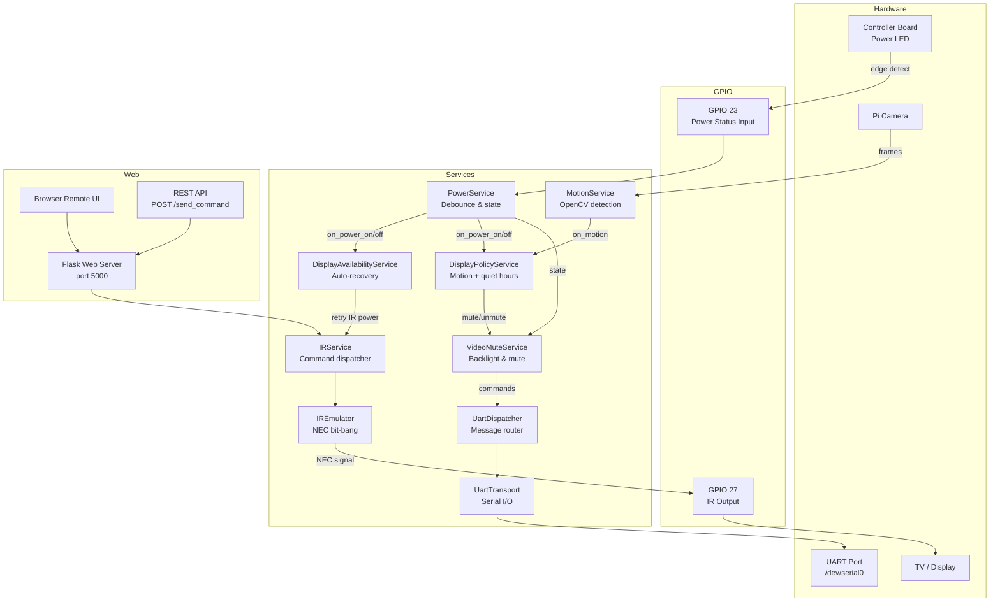

# smartmirrord

`smartmirrord` is a Raspberry Pi daemon for **state management and hardware control** of a smart mirror conversion built from a **Lululemon workout mirror**. It monitors TV power state via GPIO, sends IR commands for display control, detects motion with the camera to automate the display, and exposes a **Flask web UI + REST API** for remote control.

> **⚠️ Important:** project is designed for a specific hardware. It was built around the Samsung BN94-06778C mainboard. While most features may work on other boards, I do not guarantee compatibility. Your mileage may vary if you have a different controller.
## Table of Contents

- [Overview](#overview)
- [Features](#features)
- [Hardware & Architecture](#hardware--architecture)
- [Getting Started](#getting-started)
  - [Prerequisites](#prerequisites)
  - [Installation](#installation)
  - [Configuration](#configuration)
- [Usage](#usage)
  - [Running](#running)
  - [Updating](#updating)
  - [Web UI Remote](#web-ui-remote)
  - [REST API](#rest-api)
- [Available IR Commands](#available-ir-commands)
- [Configuration Reference](#configuration-reference)
- [Project Structure](#project-structure)
- [Notes](#notes)

---

## Overview

This project converts a **Lululemon workout mirror** into a smart mirror driven entirely by a Raspberry Pi. The daemon manages:

- **Display power** — reads the TV controller board's power LED via GPIO to know if the display is on or off, and automatically recovers if the display goes dark unexpectedly.
- **IR control** — emits Samsung NEC IR codes directly from a GPIO pin (no IR LED or receiver required), giving the Pi full remote-control over the display.
- **Motion detection** — uses the Raspberry Pi camera and OpenCV to detect presence, automatically waking or muting the display and respecting configurable quiet hours.
- **Video mute** — sends backlight and panel-mute commands over UART for quick, low-latency display toggling.
- **Web remote** — a mobile-friendly browser UI and REST API for manual control from any device on the local network.

---

## Features

- 📡 **IR emulation** — full Samsung TV command set sent via GPIO bit-banging (NEC protocol, no hardware IR blaster needed)
- 🔌 **Power state monitoring** — edge-triggered GPIO reads the display LED to detect on/off state with debouncing
- 📷 **Motion detection** — OpenCV-based frame differencing via Picamera2 triggers automatic wake/sleep
- 🕰️ **Quiet hours** — configurable schedule suppresses motion-triggered wake during set hours
- 🔁 **Auto-recovery** — `DisplayAvailabilityService` retries IR power if the display drops unexpectedly
- 🖥️ **Video mute** — UART commands control panel backlight and video mute independently of IR
- 🌐 **Web remote** — mobile-friendly UI at `http://<pi-ip>:5000/`
- 🔗 **REST API** — simple `POST /send_command` endpoint for home-automation integrations
- ⚙️ **systemd integration** — runs as a hardened system service, restarts on failure

---

## Hardware & Architecture

### Component Map

| Component | Interface | GPIO / Device | Purpose |
|-----------|-----------|---------------|---------|
| TV display | IR (bit-bang) | GPIO pin 27 | Send Samsung NEC IR commands |
| TV controller board | GPIO input | GPIO pin 23 | Read power LED to detect on/off state |
| Raspberry Pi Camera | libcamera / Picamera2 | CSI | Motion detection frames |
| UART debug port | Serial | `/dev/serial0` @ 115200 | Video mute & backlight control |

### System Architecture Diagram



---

## Getting Started

### Prerequisites

- **Hardware:** Raspberry Pi (any model with GPIO and CSI camera port) running Raspberry Pi OS
- **Python:** 3.9 or later
- **System packages** (installed automatically by `install.sh`):
  - `python3-picamera2` — camera interface (must be installed via `apt`, not `pip`)
  - `python3-venv`
- **Python packages** (installed into a venv):
  - `Flask >= 3.0`
  - `pyserial >= 3.5`
  - `opencv-python >= 4.8`
  - `numpy >= 1.24`

### Installation

1. **Clone the repository** on your Raspberry Pi:
   ```bash
   git clone https://github.com/WillLeeCoyote/smartmirrord.git
   cd smartmirrord
   ```

2. **Run the installer** as root:
   ```bash
   sudo bash install.sh
   ```

   The installer will:
   - Create a dedicated `smartmirror` system user with the required hardware groups (`gpio`, `dialout`, `video`)
   - Copy the application to `/opt/smartmirrord`
   - Install system dependencies via `apt`
   - Create a Python virtual environment at `/opt/smartmirrord/venv`
   - Install Python dependencies
   - Register and start the `smartmirrord` systemd service

3. **Edit the configuration** (if not done before installation):
   ```bash
   sudo nano /opt/smartmirrord/.env
   ```

4. **Verify the service is running:**
   ```bash
   sudo systemctl status smartmirrord
   journalctl -u smartmirrord -f
   ```

### Configuration

Copy `.env.example` to `.env` and edit the values for your setup (the installer does this automatically on first install):

```bash
cp .env.example .env
```

See the [Configuration Reference](#configuration-reference) section for all available options.

---

## Usage

### Running

**As a systemd service (recommended for production):**
```bash
sudo systemctl start smartmirrord
sudo systemctl stop smartmirrord
sudo systemctl restart smartmirrord
sudo systemctl status smartmirrord
```

**View live logs:**
```bash
journalctl -u smartmirrord -f
```

**Manually for development:**
```bash
python -m smartmirrord
```

### Updating

To pull the latest code and restart the service:
```bash
cd /opt/smartmirrord
./deploy.sh
```

The deploy script will:
1. Pull the latest code from `origin/master`
2. Update Python dependencies in the venv
3. Reload systemd if the service file changed
4. Restart the `smartmirrord` service

### Web UI Remote

Open a browser to `http://<pi-ip>:5000/` for the mobile-friendly remote control interface. The UI is dynamically populated with all available IR commands.

### REST API

#### `POST /send_command`

Send a named IR command to the display.

**Request**
```
Content-Type: application/json
```
```json
{ "command": "power" }
```

**Response**
- `200 OK` — command sent successfully
  ```json
  { "status": "ok" }
  ```
- `400 Bad Request` — unknown or invalid command
  ```json
  { "status": "error", "message": "Unknown command: foo" }
  ```
- `500 Internal Server Error` — hardware error

**Example:**
```bash
curl -X POST http://<pi-ip>:5000/send_command \
  -H "Content-Type: application/json" \
  -d '{"command": "volup"}'
```

---

## Available IR Commands

The following commands can be sent via the web UI or REST API. All use the Samsung NEC IR protocol.

| Command | Description | Command | Description |
|---------|-------------|---------|-------------|
| `power` | Toggle power | `mute` | Toggle audio mute |
| `volup` | Volume up | `voldown` | Volume down |
| `chup` | Channel up | `chdown` | Channel down |
| `up` | Navigate up | `down` | Navigate down |
| `left` | Navigate left | `right` | Navigate right |
| `ok` | Confirm / OK | `back` | Back |
| `menu` | Open menu | `exit` | Exit menu |
| `source` | Input source | `epg` | Electronic programme guide |
| `tools` | Tools menu | `list` | Channel list |
| `media` | Media player | `text` | Teletext |
| `play` | Play | `pause` | Pause |
| `stop` | Stop | `rewind` | Rewind |
| `forward` | Fast forward | `previous` | Previous |
| `0`, `1`, `2`, ... `9` | Number keys | `p` | Picture mode |
| `a`, `b`, `c`, `d` | Colour buttons | `subtitle` | Subtitles |
| `start` | Smart Hub / Home | | |

---

## Configuration Reference

All settings are loaded from the `.env` file at startup. The `.env.example` file documents every option:

| Variable | Default | Description |
|----------|---------|-------------|
| `LOG_LEVEL` | `INFO` | Logging verbosity (`DEBUG`, `INFO`, `WARNING`, `ERROR`) |
| `LOG_TO_CONSOLE` | `True` | Print log output to stdout |
| `LOG_TO_FILE` | `True` | Write logs to file |
| `LOG_FILE_PATH` | `/var/log/smartmirrord/smartmirrord.log` | Log file location |
| `UART_DEBUG` | `False` | Enable verbose UART logging |
| `GPIO_CHIP_PATH` | `/dev/gpiochip0` | GPIO character device path |
| `GPIO_POWER_STATUS_PIN` | `23` | GPIO pin number for the power LED input |
| `GPIO_IR_INPUT_PIN` | `27` | GPIO pin number used to drive the IR output signal (bit-bang transmitter) |
| `CAMERA_WIDTH` | `640` | Camera capture width (pixels) |
| `CAMERA_HEIGHT` | `480` | Camera capture height (pixels) |
| `MOTION_WIDTH` | `320` | Downscaled width used for motion calculation |
| `MOTION_HEIGHT` | `240` | Downscaled height used for motion calculation |
| `MOTION_THRESHOLD` | `150` | Pixel-change threshold to trigger motion |
| `MOTION_COOLDOWN_SEC` | `6` | Seconds to suppress repeated motion events |
| `UART_PORT` | `/dev/serial0` | Serial port for UART communication |
| `UART_BAUDRATE` | `115200` | UART baud rate |
| `DISPLAY_POLICY_TIMEOUT` | `15` | Seconds after last motion before re-muting the display |
| `FLASK_HOST` | `0.0.0.0` | Flask bind address |
| `FLASK_PORT` | `5000` | Flask listen port |

---

## Project Structure

```
smartmirrord/
├── smartmirrord/               # Main application package
│   ├── __main__.py             # Entry point — wires up and starts all services
│   ├── config.py               # Loads configuration from .env
│   ├── logging_config.py       # Logging initialisation
│   │
│   ├── hardware/               # Low-level hardware drivers
│   │   ├── power_status.py     # GPIO edge detection for power LED
│   │   ├── ir_emulator.py      # NEC IR bit-bang transmitter
│   │   ├── ir_codes.py         # Samsung IR command codes
│   │   ├── ir_timing.py        # NEC protocol timing constants
│   │   ├── camera.py           # Picamera2 capture interface
│   │   └── uart_transport.py   # Serial UART read/write
│   │
│   └── services/               # Business logic services
│   │   ├── power_service.py            # Power state with debounce timer
│   │   ├── ir_service.py               # IR command validation & dispatch
│   │   ├── motion_service.py           # OpenCV motion detection
│   │   ├── display_policy_service.py   # Motion + quiet-hours display control
│   │   ├── display_availability_service.py  # Auto-recovery for unexpected power-off
│   │   ├── uart_dispatcher.py          # Pub/sub UART message router
│   │   └── videomute_service.py        # Panel backlight & video mute over UART
│   │
│   └── web/                    # Flask web interface
│       ├── routes.py           # Route handlers
│       ├── templates/
│       │   └── index.html      # Remote control UI
│       └── static/
│           ├── style.css       # Mobile-friendly remote styling
│           └── favicon.svg
│
├── .env.example                # Configuration template
├── requirements.txt            # Python dependencies
├── install.sh                  # First-time installation script
├── deploy.sh                   # Update & restart script
└── smartmirrord.service        # systemd service unit file
```

---

## Notes

- This project is intended to run on hardware with GPIO access (e.g., a Raspberry Pi). It will not run correctly on a standard desktop.
- Power-state monitoring depends on tapping the power LED signal from your specific controller board. Ensure the LED signal is **only outputting 3.3V** before connecting to the GPIO input pin.
- `picamera2` must be installed via `apt` (`sudo apt install python3-picamera2`), not via `pip`, to ensure compatibility with `libcamera`.
- The systemd service runs as the `smartmirror` user with `ProtectSystem=strict` and other hardening options. Ensure the `smartmirror` user has access to all required hardware groups (`gpio`, `dialout`, `video`, `render`).